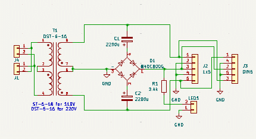

# TRS-80_Model1_Power_Supply
Replacement power supply for TRS-80 Model 1 computer

### Overview
The TRS-80 Model 1 power supply is pretty simple.  It's essentially just a transformer with two center tapped secondary windings.  The one secondary is literally just that and is referred to as the AC output.  The other is rectified with two diodes to create a full wave rectified DC output and referred to as the DC output.  The AC output is rectified, filtered, and regulated in the keyboard unit for +5V and -5V.  The DC output is filtered and regulated in the keyboard unit for +12V.

### Elecrical Design
The challenge of designing a replacement is such dual winding transformers especially with the proper voltages are not commonly available.  A straightforward solution is to just use two separate transformers and there are designs that do that.  My solution is more clever - it uses a voltage doubler from the AC output to generate the DC output.  Since 12V as about 2*5V the doubled voltage is about right for input to the +12V regulator - and the voltage isn't too critical because the +12V load is relatively small so if that voltage is a little too high it won't get too hot.  On the contrary the +5V load is relatively large (about 1A) so the AC output voltage is more critical which amounts to the selection of a proper transformer.

So the design strategy is to select a transformer based on the requirements for the AC output and then use a voltage doubler off of that for the DC output.

Besides the transformer only three additional components are required - two capacitors and a diode bridge.  This is the complete schematic.

The power indicator LED is optional (the original did not have one).

### Mechanical Design
The PCB is designed to fit in a 3D printed replica of the original power brick.  The original had permanently attached pigtails for the AC input and the output power.  Since the power connector on the keyboard unit is a 5-pin female DIN connector it's convenient to also use a 5-pin female DIN connector at the power supply so that a MIDI cable (5-pin male DIN to 5-pin male DIN) cable can be used.  The output connector is dual footprinted so that a 5-pin Molex type connector can be used for a removable pigtail, or a fixed pigtail can be soldered directly to the PCB.  Similarly the main AC input is dual footprinted for a vertical or horizontal 2-pin Molex type connector or an AC power cord can be soldered directly to the PCB.

This is the completed PCB with horizontal AC input connector and 5-pin DIN output connector.

### Case Design
TBD
